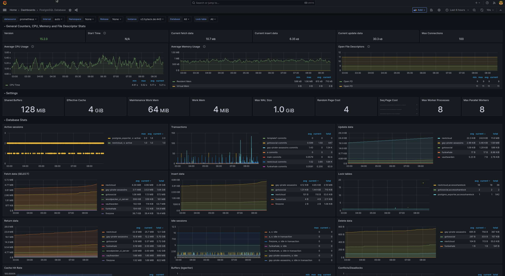

# prometheus_postgres_exporter

This is an [Ansible](https://www.ansible.com/) role which installs [Prometheus Postgres Exporter](https://github.com/prometheus-community/postgres_exporter) to run as a [Docker](https://www.docker.com/) container wrapped in a systemd service.

This role *implicitly* depends on:

- [`com.devture.ansible.role.playbook_help`](https://github.com/devture/com.devture.ansible.role.playbook_help)
- [`com.devture.ansible.role.systemd_docker_base`](https://github.com/devture/com.devture.ansible.role.systemd_docker_base)

> **NOTE**: check [defaults/main.yml](./defaults/main.yml) to see full list of config options

# Integrate with Grafana

You can use the dasboard [9628](https://grafana.com/grafana/dashboards/9628-postgresql-database/) to visualize the data in Grafana. The varaible `prometheus_postgres_exporter_dashboard_urls` might help you.

